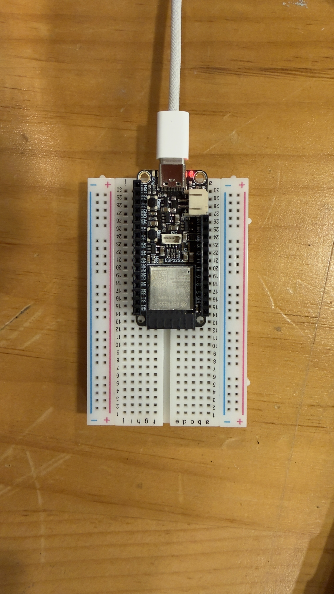
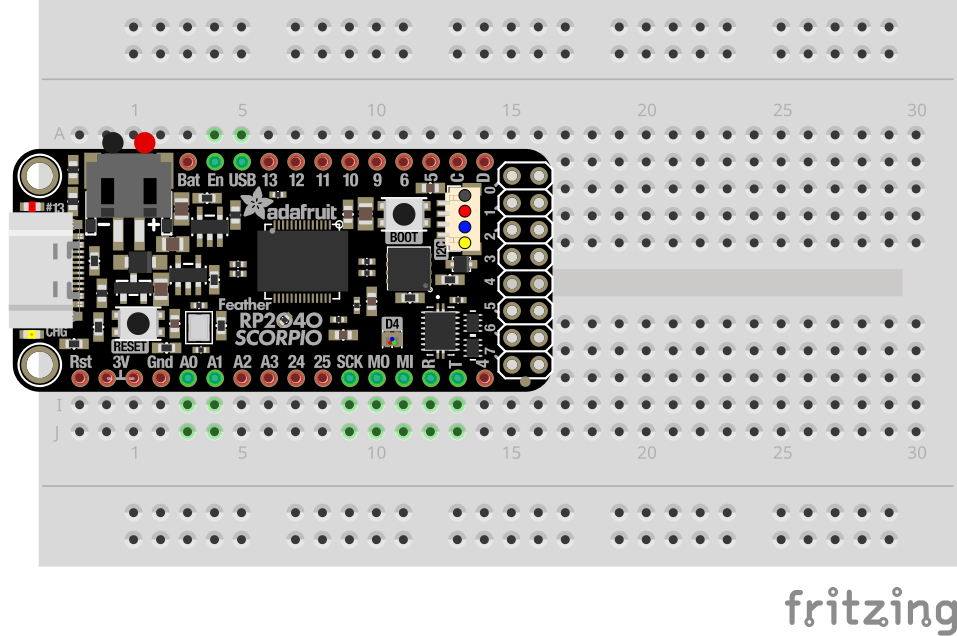

# 00 Hello, World!

The very first exercise you should attempt is to blink the internal LED on the ESP32 board. This is less about learning the code, and more about testing the board and the connection to it. 
## Components

| Component     | Quantity |
|---------------|----------|
| Mounted ESP32 | 1        |

## Circuit Pictures

*An image of the completed circuit.*

*A breadboard diagram of the circuit. It gets more interesting than this, I promise.*

## Exercise Steps

### 1. Download the ESP32 interface from the IDE

Go to `File > Preferences` and add `https://espressif.github.io/arduino-esp32/package_esp32_index.json` to the Additional Board Manager URLs. This will allow the Arduino IDE to talk to the board.

Then go to Tools > Board > Boards Manager, search for esp32, and install the package by Espressif Systems, version 2.0.6 or 2.0.14 (a several hundred MB download).

### 2. Connect the board to the laptop

Connect the board to your computer using the USB cable from the IoT kit.
- Set the board: `Tools > Board > Adafruit ESP32S3 Feather 2MB PSRAM` (you will likely have to scroll down)
- Set the port: `Tools > Port > ` the USB connection (probably /dev/ttyACM0 or /dev/ttyACM1 on Ubuntu, or /dev/cu.SLAB_USBtoUART on a MAC, or e.g. COM15 on Windows)

### 3. Load the Blink sketch in the IDE

You can find the script at `File > Examples > 01.Basics > Blink`. The example scripts are very useful if you are adding a new feature and you need to check your implementation against the example.

The sketch will blink the internal LED on the board on and off every second. You don't need to change any code at this point - it should work out the box.

### 4. Upload the sketch

Click the Upload button (the right-pointing arrow near the top left). The IDE will compile the sketch and upload it to the board. You should see output in the console at the bottom, ending with Done uploading.

### 5. Check the result

Once uploaded, the onboard LED should begin blinking on and off once per second. If it does, your board is working and you're ready to [move on to the next exercise!](../01-blinking-led/01-blinking-led.md)

> **Having trouble?** If the port doesn't appear, try a different USB cable — some cables might be broken. If the upload fails, try holding the BOOT button on the ESP32 while the upload starts. If all else fails, either ask your partner or a workshop attendant.
