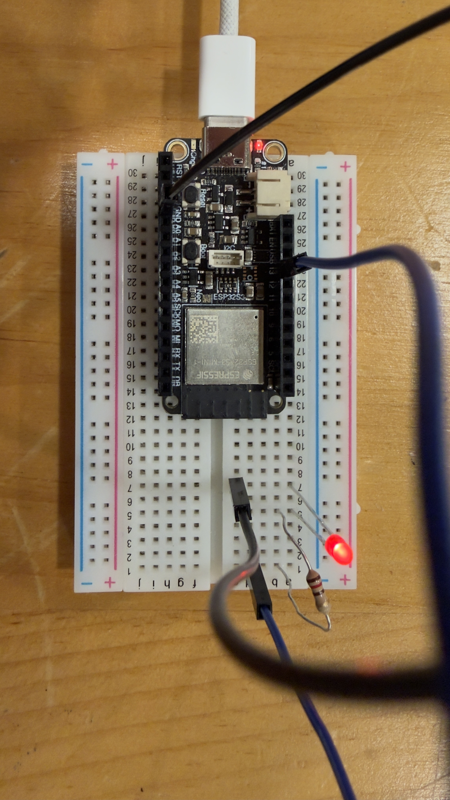
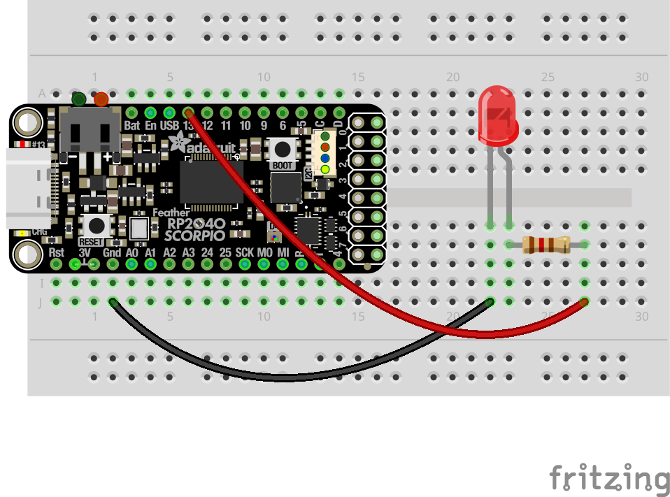

# 01 Blinking LED

Now that the board is working, let's wire up an external LED. You'll use the same Blink sketch as before — the only difference is that the LED is now a physical component you've wired up yourself.

## Components
| Component     | Quantity |
|---------------|----------|
| Mounted ESP32 | 1        |
| LED           | 1        |
| 120Ω Resistor | 1        |
| Jumper Wires  | 2        |

## Circuit Pictures

*An image of the completed circuit.*

*A breadboard diagram of the circuit.*

## Circuit

Wire the circuit as follows:
- Connect **pin 13** on the ESP32 to the **anode** (long leg) of the LED via a 120Ω resistor
- Connect the **cathode** (short leg) of the LED to a **GND** pin on the ESP32

New to breadboards or LEDs? Read this first.

**Breadboards** let you build circuits without soldering. Components and wires plug into holes that are connected internally — the rows of holes (A–E and F–J) are connected horizontally, and the power rails running along the edges are connected vertically.

**LEDs** (Light Emitting Diodes) only allow current to flow in one direction — this is why the leg length matters. The long leg (anode) connects toward the positive voltage, and the short leg (cathode) connects to ground.

**Resistors** are needed to limit the current through the LED. Without one, too much current flows and the LED will burn out. For a 3.3V board like the ESP32 with a typical LED, a 120Ω resistor is appropriate.

## Exercise Steps

### 1. Wire up the circuit
Following the circuit diagram above, connect the LED and resistor to the breadboard.

### 2. Upload the Blink sketch
You should still have the Blink sketch open from the previous exercise. If not, find it again at `File > Examples > 01.Basics > Blink`. Upload it to the board as before.

### 3. Check the result
Your external LED should now be blinking on and off once per second. If it does, you're ready to [move on to the next exercise!](../02-blinking-led-button/02-blinking-led-button.md)

> **Having trouble?** Check that the LED is the right way round — the long leg should be on the resistor side. If it's still not working, try a different LED from the kit.
