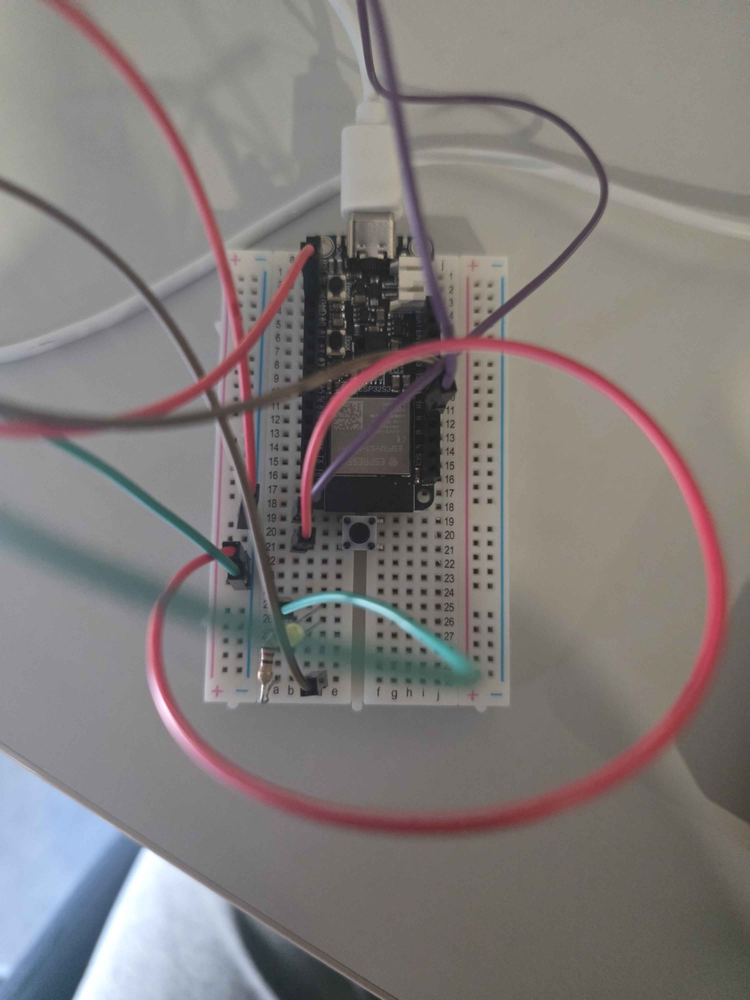
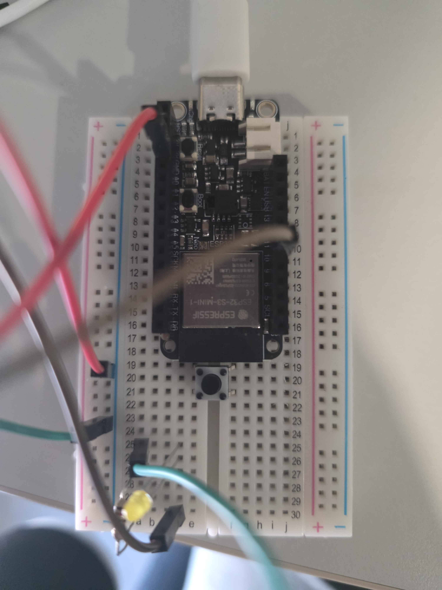
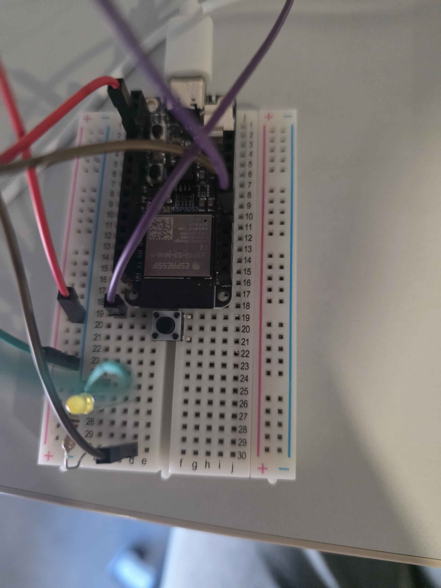

# 02 Blinking LED with Button

Now that your button blinks, lets wire it up to a button to turn that blinking on and off.

## Components
| Component     | Quantity |
|---------------|----------|
| Mounted ESP32 | 1        |
| LED           | 1        |
| 120Ω Resistor | 1        |
| Jumper Wires  | 5        |
| Button        | 1        |

## Circuit Pictures

*An image of the completed circuit.*

## Circuit

Wire the circuit as follows:
- Place the button in between the two halves of the breadboard as follows. 

- Connect the **left side** of the button to a pin on the ESP32 as follows.

- Connect the **right side** of the button to a pin on the **GND** as follows.

New to breadboards or LEDs? Read this first.

**Breadboards** let you build circuits without soldering. Components and wires plug into holes that are connected internally — the rows of holes (A–E and F–J) are connected horizontally, and the power rails running along the edges are connected vertically.

**LEDs** (Light Emitting Diodes) only allow current to flow in one direction — this is why the leg length matters. The long leg (anode) connects to the positive voltage, and the short leg (cathode) connects to ground.

**Resistors** are needed to limit the current through the LED. Without one, too much current flows, and the LED will burn out. For a 3.3V board like the ESP32 with a typical LED, a 120Ω resistor is appropriate.

## Exercise Steps

### 1. Wire up the circuit
Follow the instructions above. 

### 2. Upload the Blink sketch and change the Variables
You should download/copy-paste the code file into your IDE. Change the PUSH_BUTTON variable to the pin that you connected the left side of your button to. 

### 3. Check the result
Your external LED should now be blinking on and off once per second. When you click the button, it should stop blinking. If you click it again, it will resume blinking. If it does, you're ready to [move on to the next exercise!](../03-traffic-lights/03-traffic-lights.md)

> **Having trouble?** Check that the LED is the right way round — the long leg should be on the resistor side. If it's still not working, try a different LED from the kit. If your code doens't run hold the Boot button before plugging in your USB. Once it is plugged in, run your code and unplug and replug into your laptop. It should work as intended once you have done that. If not please ask a representative to assist you.

## Extension
Try to add varying behaviour with button presses, for example:
- Blinking pauses when the button is held down
- If the button is pressed twice in quick succession, the blink rate increases