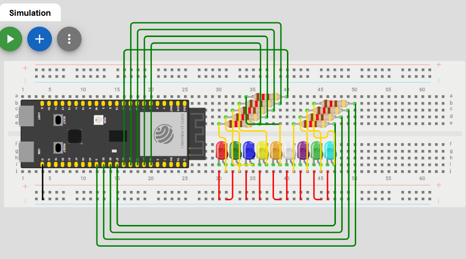
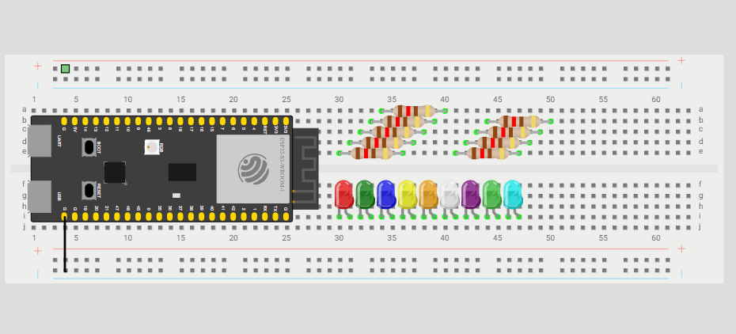

# 04 9-LED

Now that your button blinks, lets wire it up to a button to turn that blinking on and off.

## Components
| Component     | Quantity |
|---------------|----------|
| Mounted ESP32 | 1        |
| LED           | 3        |
| 120Ω Resistor | 3        |
| Jumper Wires  | 28       |
| Button        | 1        |

## Circuit Pictures

*An image of the completed circuit.*

## Circuit

Wire the circuit as follows:
- Place the LEDS in similar locations in two rows or three rows (Row A,B,C). Place the transitors in similar locations in different columns (Col 3 and Col 6, Col 4 and Col 7). Make sure to connect the ground on the ESP32 to the negative side of the breadboard.

- Connect the cathode (short side) of the LEDs to the ground. Connect the anode (long side) of the LEDS to the left side of the resistor. Connect the right side of the resistor to a pin on the ESP32. 

New to breadboards or LEDs? Read this first.

**Breadboards** let you build circuits without soldering. Components and wires plug into holes that are connected internally — the rows of holes (A–E and F–J) are connected horizontally, and the power rails running along the edges are connected vertically.

**LEDs** (Light Emitting Diodes) only allow current to flow in one direction — this is why the leg length matters. The long leg (anode) connects toward the positive voltage, and the short leg (cathode) connects to ground.

**Resistors** are needed to limit the current through the LED. Without one, too much current flows and the LED will burn out. For a 3.3V board like the ESP32 with a typical LED, a 120Ω resistor is appropriate.

## Exercise Steps

### 1. Wire up the circuit
Follow the instructions above. 

### 2. Upload the Blink sketch and Change the Variables
You should download/copy-paste the code file into your IDE. Change the variable pins for the leds to the corresponding ones on your ESP32. 

### 3. Check the result
Your LEDS should now be blinking in succession of one another. [move on to the next exercise!](../04-9-led/04-9-led.md)

> **Having trouble?** Check that the LED is the right way round — the long leg should be on the resistor side. If it's still not working, try a different LED from the kit. If your code doens't run hold the Boot button before plugging in your USB. Once it is plugged in, run your code and unplug and replug into your laptop. It should work as intended once you have done that. If not please ask a representative to assist you.
