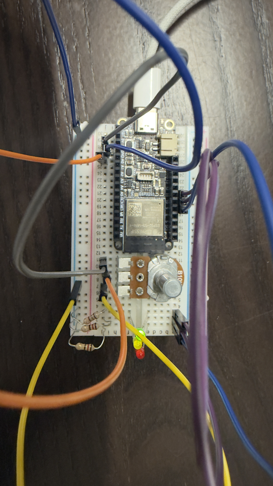
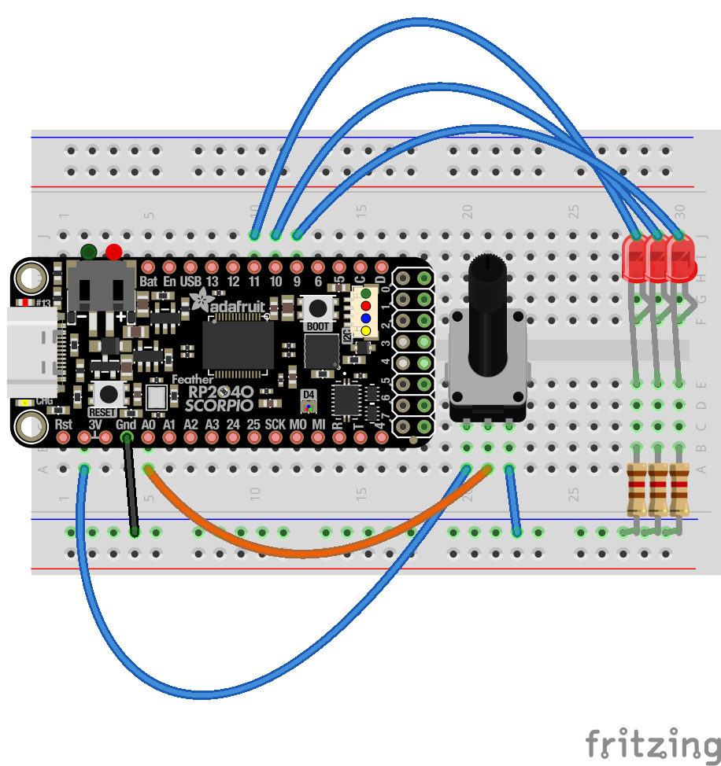

# 05 Potentiometer LED Selector

Every signal so far has been digital, HIGH or LOW, a 1 or a 0. Now it's time to go analog! We'll be reading a variable signal from a potentiometer and using it to control which of three LEDs is lit depending on how far the dial is turned.

## Components

| Component      | Quantity |
|----------------|----------|
| Mounted ESP32  | 1        |
| LED            | 3        |
| 120Ω Resistor  | 3        |
| Jumper Wires   | 7        |

## Circuit Pictures

*An image of the completed circuit.*

*A breadboard diagram of the circuit — note the diagram uses a different board, but the pin numbers are correct.*

## Circuit

Wire the circuit as follows:

- Connect the **left leg** of the potentiometer to **GND**
- Connect the **right leg** of the potentiometer to **3.3V**
- Connect the **middle (wiper) leg** of the potentiometer to **pin A3**
- Connect **pin 5** to the **anode** (long leg) of the **red LED** via a 120Ω resistor, cathode to GND
- Connect **pin 6** to the **anode** of the **amber LED** via a 120Ω resistor, cathode to GND
- Connect **pin 9** to the **anode** of the **green LED** via a 120Ω resistor, cathode to GND

New to potentiometers? Read this first.

A **potentiometer** is a variable resistor with three legs. The two outer legs connect to power and ground, and the middle leg (called the wiper) outputs a voltage somewhere between the two depending on the dial position. As you turn the dial, the output voltage sweeps from 0V to 3.3V.

The ESP32 reads this as a number between **0 and 4095** using its analog-to-digital converter (ADC). The sketch splits this range into three equal thirds — one for each LED.

## Exercise Steps

### 1. Wire up the circuit

Following the circuit diagram above, connect the potentiometer and three LEDs to the breadboard.

### 2. Open the sketch

Open `05-potentiometer-leds.ino` in the Arduino IDE.

### 3. Upload and run

Upload the sketch to your ESP32. Once running, turn the potentiometer dial — one LED should light up depending on the dial position:

- **Bottom third** → red LED
- **Middle third** → amber LED
- **Top third** → green LED

### 4. Check the Serial Monitor

Open the Serial Monitor (`Tools > Serial Monitor`) and set the baud rate to **115200**. You should see the raw potentiometer values printing as you turn the dial. Notice how the value changes between 0 and 4095.

### 5. You're done!

Once all three LEDs respond correctly to the dial, you're ready to [move on to the next exercise!](../06-dimming-leds/06-dimming-leds.md)

> **Having trouble?** Double-check the potentiometer orientation — the wiper must be on A3. If an LED isn't lighting up, check it's the right way round (long leg toward the resistor).
